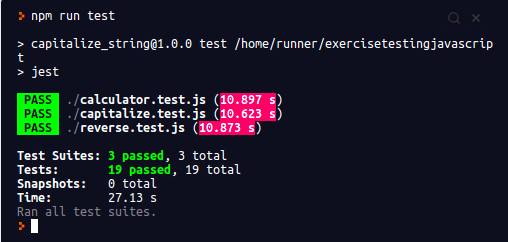

<h3 align="center">Jest Testing Exercise</h3>

At this project I test different methods like capitalizing string, reverse string and basic calculator operations by using a JavaScript test suite called Jest that uses red, green refactor TDD approach to first find the error and only after that create the related method.

## App Screenshot

## Live Link Demo

[Live Link Demo](https://marcelomaidden.github.io/exercise_testing_javascript/)

## Built With

- Javascript
- Jest

## Getting Started

To get a local copy up and running follow these simple example steps.

### Prerequisites

- Text Editor (VSCode is suggested.)

### Setup

- Install [git](https://git-scm.com/downloads)
- Open Terminal
- Change directory to folder to download repository
- Use `cd <file-path>`
- Run `git clone https://github.com/marcelomaidden/exercise_testing_javascript`
- Use `cd exercise_testing_javascript` to change to the project folder
- Install all dependencies by running `npm install` on your terminal

To make any change,

- Open related file by using text editor.

## Usage

  - In order to run all tests use the command `npm run test`

## Author

👤  **Marcelo Fernandes**

- GitHub: [@marcelomaidden](https://github.com/marcelomaidden)
- Twitter: [@marcelomaidden](https://twitter.com/marcelomaidden)
- LinkedIn: [Marcelo Fernandes](https://linkedin.com/in/marcelofernandesdearaujo) 
## 🤝 Contributing

Contributions, issues and feature requests are welcome! Start by:

- Forking the project
- Cloning the project to your local machine
- `cd` into the project directory
- Run `git checkout -b your-branch-name`
- Make your contributions
- Push your branch up to your forked repository
- Open a Pull Request with a detailed description to the development branch of the original project for a review

## Show your support

Give a ⭐️ if you like this project!

## Acknowledgments

- Jest
- Javascript
- Node

## 📝 License

This project is [MIT](LICENSE) licensed.
